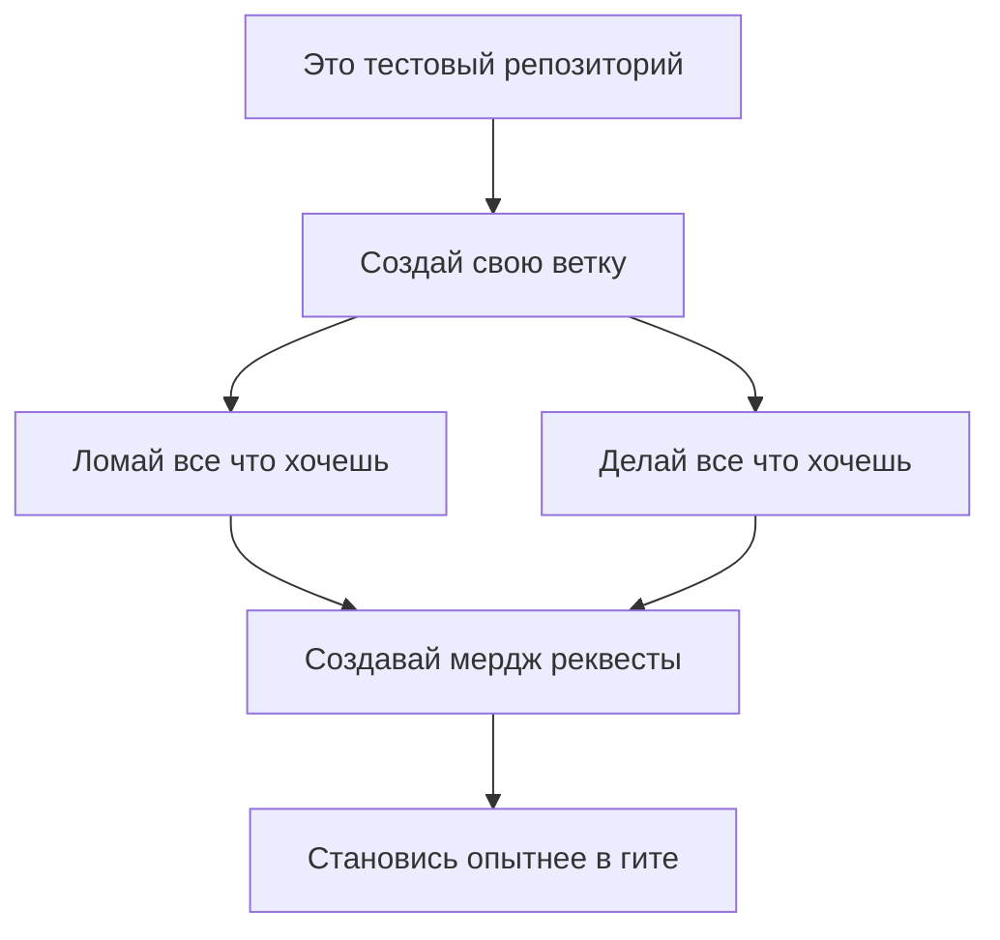

# For test purposes of GitHub

Мои ютуб туториалы в помощь -> [__ССЫЛКА НА ПЛЕЙЛИСТ__](https://youtube.com/playlist?list=PLou0mfoS85QUjp8qcct474odigF_qKNfM&si=MZS2nI3qOWPHGBDF)

```mermaid
graph TD;
    A["Это тестовый репозиторий"] --> B["Создай свою ветку"];
    B --> C["Ломай все что хочешь"];
    B --> D["Делай все что хочешь"];
    C --> E["Создавай мердж реквесты"];
    D --> E;
    E --> F["Становись опытнее в гите"];
```

